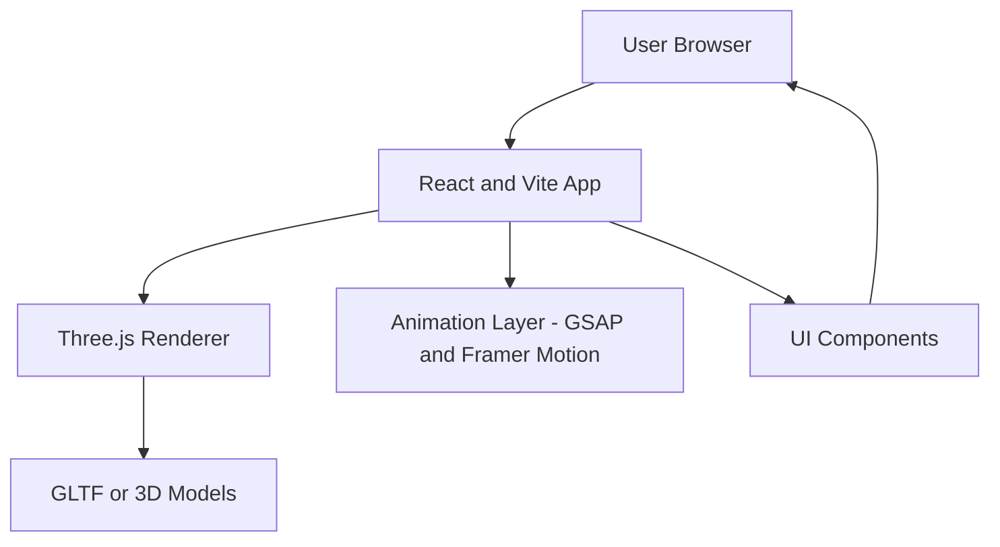

# 🧠 Abdullah Bakouni — 3D Portfolio

[]()
[]()
[]()
[]()

> A fully interactive **3D developer portfolio** built using **Three.js**, **React**, and **Vite**,  
> showcasing modern WebGL animations, dynamic lighting, and smooth UI transitions — designed and developed by **Abdullah Bakouni**.

---

## 🖥️ Overview

This portfolio brings 3D storytelling to the web — featuring:
- Realistic 3D scenes powered by **Three.js**
- Seamless navigation and responsive layout
- Smooth scroll-based animations and dynamic lighting
- Fast build and hot-reload with **Vite**
- Deployed for optimal performance on **Vercel**

---

## 🧱 Tech Stack

| Layer | Technology |
|-------|-------------|
| Rendering | Three.js / React Three Fiber |
| Framework | React 18 + Vite |
| Animation | GSAP / Framer Motion |
| Styling | TailwindCSS |
| Deployment | Vercel |
| 3D Assets | Blender / GLTF Models |

---

## ✨ Features

- 🌌 Interactive 3D environment and camera movement  
- 🧩 Responsive design for all screen sizes  
- ⚡ Optimized with Vite and lazy-loaded models  
- 🎨 Dynamic lighting and real-time shading  
- 📜 About, Skills, and Projects sections in 3D space  
- 🧭 Smooth transitions with React Router or Framer Motion  

---

## 🗺️ Architecture Diagram


# ⚙️ Installation
1️⃣ Clone the repository
```bash
git clone https://github.com/AbdullahBakouni/Abdullah-Bakouni.git
cd Abdullah-Bakouni
```
2️⃣ Install dependencies
```bash
npm install
# or
yarn install
```
3️⃣ Run locally
```bash
npm run dev
```

# 🌍 Deployment

This project is fully optimized for Vercel.
Simply push your repo and connect it via https://vercel.com
.

Tip: Ensure your 3D assets are compressed (GLTF/DRACO) for best load times.

# 📦 Folder Structure
```css
📦 Abdullah-Bakouni
 ┣ 📂 src
 ┃ ┣ 📂 components
 ┃ ┣ 📂 assets
 ┃ ┣ 📂 scenes
 ┃ ┣ 📜 App.jsx
 ┃ ┗ 📜 main.jsx
 ┣ 📜 vite.config.js
 ┣ 📜 package.json
 ┣ 📜 README.md
 ┗ 📜 .env.example
```
# 🛠️ Environment Variables
```env
# Optional environment variables for API / analytics integrations
VITE_EMAIL_SERVICE_KEY=your_service_key
VITE_ANALYTICS_ID=your_analytics_key
```
# 🛣️ Roadmap

 Add interactive contact form with email.js

 Add environment reflections and HDR lighting

 Optimize 3D models for mobile devices

 Add sound effects and ambient music

# 🤝 Contributing

Pull requests are welcome.
Fork the repo → Create your branch → Commit → Open a PR 🎉

# 📜 License

Licensed under the MIT License © 2025 [Abdullah Bakouni](https://github.com/AbdullahBakouni)

# 🌐 Visit My Website

👉 https://abdullah-bakouni.vercel.app
